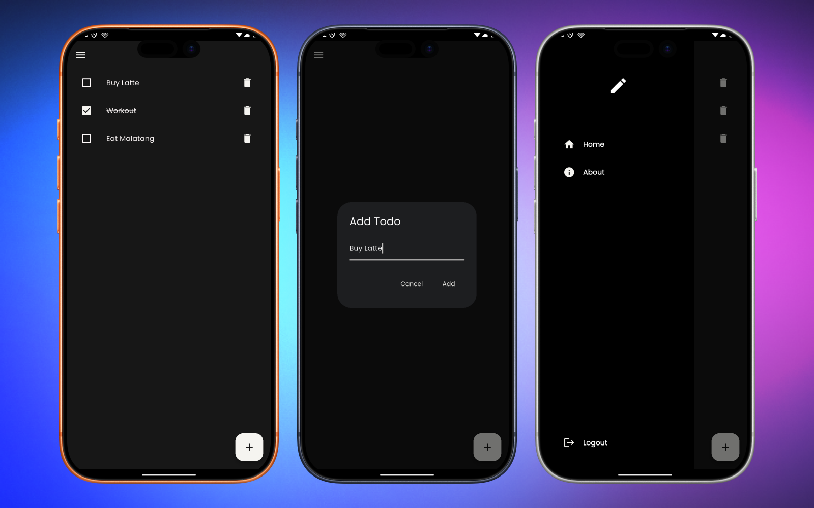

# Taskly

[](https://github.com/fathorrosi-dev/taskly/actions)
[](https://pub.dev/packages/taskly)
[](LICENSE)

## Project Overview

Taskly is a lightweight Flutter todo app that demonstrates a clean architecture approach (data, domain, presentation) with local persistence using SQLite. It provides simple task management using BLoC/Cubit for state management and organized use-cases for business logic.

Purpose: provide a minimal, well-structured example app for managing tasks
locally on mobile and desktop platforms, useful as a starter template or
learning resource for clean architecture in Flutter.

Problem it solves: makes it easy to bootstrap a cross-platform Flutter app
with separation of concerns, local storage, and a predictable state
management pattern.



---

## Features

- Add, update, and delete todo items stored locally (SQLite).
- Clean architecture layers: `data`, `domain`, and `presentation`.
- State management using `flutter_bloc` (`Cubit`).
- Local persistence via `sqflite` and a `database_helper` utility.
- Routing using `go_router` (lightweight navigation).
- Responsive support for mobile, web, and desktop (platform folders present).

Unique selling points:
- Clear example of structuring a Flutter app with explicit use-cases
	(`domain/usecases`) and repository abstractions.
- Minimal dependencies and easy-to-follow data flow from UI to persistence.

---

## Tech Stack

- Programming language: Dart (SDK >= 3.10.7)
- Framework: Flutter
- State management: `flutter_bloc`
- Dependency injection: `get_it`
- Routing: `go_router`
- Local DB: `sqflite`
- Utilities: `path`, `path_provider`
- Other packages: `dartz`, `equatable`, `google_fonts`

Key dependencies (see `pubspec.yaml`):

```yaml
dependencies:
	flutter:
		sdk: flutter
	dartz: ^0.10.1
	equatable: ^2.0.8
	flutter_bloc: ^9.1.1
	get_it: ^9.2.0
	go_router: ^17.0.1
	google_fonts: ^7.0.0
	path: ^1.9.1
	path_provider: ^2.1.5
	sqflite: ^2.4.2
	cupertino_icons: ^1.0.8
```

---

## Installation

### Prerequisites

- Install Flutter (stable channel) and ensure `flutter` is on your `PATH`.
- For mobile targets, install Android Studio or Xcode as appropriate.
- For desktop targets, enable desktop support in Flutter.

### Setup

Clone the repository and fetch packages:

```bash
git clone https://github.com/fathorrosi-dev/taskly.git
cd taskly
flutter pub get
```

If you plan to run on Android or iOS, make sure platform tooling is set up:

```bash
flutter doctor
```

Run the app on a device or emulator:

```bash
flutter run
```

To build a release for Android:

```bash
flutter build apk --release
```

---

## Usage

Open the app and interact with the Home screen to add, edit, or delete todos.

Basic example (programmatic use):

```dart
// Get the repository from your DI container (example uses get_it)
final todoRepo = getIt<TodoRepository>();

// Add a todo (domain entity)
final todo = Todo(id: null, title: 'Buy milk', description: '2 liters', done: false);
await todoRepo.addTodo(TodoModel.fromEntity(todo));

// Fetch todos
final todos = await todoRepo.getTodos();
```

Configuration options:
- Routes are defined in `lib/router.dart`.
- Theme and style assets are in `lib/presentation/theme`.

API documentation:
This repository is an app (not an HTTP API). The primary public interfaces
are in `lib/domain` (entities, repositories, usecases) and
`lib/presentation/cubit` (state). Use those to integrate or extend logic.

---

## Project Structure

Top-level layout (key folders):

```
lib/
	injection.dart         # dependency registration (get_it)
	main.dart              # app entry
	data/                  # data layer (models, data sources, repository impl)
		data_source/
			database_helper.dart
		models/
			todo_model.dart
		repository/
			todo_repository.dart
	domain/                # domain layer (entities, repositories, usecases)
		entities/
			todo.dart
		repositories/
			todo_repositories.dart
		usecases/
			add_todo.dart
			delete_todo.dart
			get_todo.dart
			update_todo.dart
	presentation/          # UI layer
		components/
			app_scaffold.dart
		cubit/
			todo_cubit.dart
		pages/
			home_page/
				home_page.dart
	utils/                 # helpers, router, screen utils, failures
```

Platform folders: `android/`, `ios/`, `linux/`, `macos/`, `windows/`, `web/`
contain platform-specific build code.

---

## Contributing

Contributions are welcome. Suggested workflow:

1. Fork the repository.
2. Create a feature branch: `git checkout -b feat/your-feature`.
3. Make changes and follow code style.
4. Run `flutter format .` and ensure `flutter analyze` is clean.
5. Create a PR against `main` with a clear description and linked issue.

Code style & guidelines:
- Use `dartfmt` / `flutter format` for formatting.
- Follow effective Dart: prefer descriptive names and small functions.
- Keep business logic in `domain` usecases, UI-only code in `presentation`.

Pull request process:
- Open a pull request and request review.
- Include screenshots or steps to reproduce UI changes if applicable.
- Add tests for new behavior when practical.

---

## Testing

This repository includes a simple widget test under `test/widget_test.dart`.

Run all tests with:

```bash
flutter test
```

Consider adding unit tests for `domain/usecases` and widget/integration
tests for critical flows.

---

## Roadmap

Possible future improvements:

- Add synchronization with a remote backend (optional) and user accounts.
- Improve UI/UX with richer task metadata (due dates, reminders, tags).
- Add comprehensive unit & integration test coverage.
- CI integration (GitHub Actions) with badge and automated tests.

---

## License

No `LICENSE` file was found in the repository. Add a license (for example
MIT) to clarify reuse and distribution. To add MIT, create a `LICENSE`
file with the MIT text.

---

## Contact / Authors

Maintainer: fathorrosi-dev — https://github.com/fathorrosi-dev

For issues and contributions: open an issue or pull request on
https://github.com/fathorrosi-dev/taskly

---

If you'd like, I can also:

- Add a `LICENSE` file (suggest MIT). 
- Wire up a GitHub Actions CI workflow and update the build badge.
- Commit these README changes to a branch and open a PR.

Tell me which of the above you'd like me to do next.
